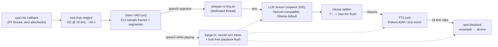

# skadoosh

[](https://crates.io/crates/skadoosh)
[](https://docs.rs/skadoosh)
[](https://github.com/Hot-Coco/Skadoosh/actions/workflows/ci.yml)
[](LICENSE-MIT)

**A modular, lightning-fast, fully local voice agent framework in Rust** — targeting
sub-150 ms from end-of-speech endpointing to first audio out on capable hardware.

Mic in. Silero VAD listens. Whisper transcribes. A local LLM streams a reply.
Kokoro speaks each clause as soon as it lands. Interrupt it mid-sentence and it
shuts up instantly. No cloud required — but any OpenAI-compatible API works.

Use it as a **binary** (`skadoosh`), or as a **library/SDK** with pluggable
engines and your choice of modalities — voice, text, files, or any mix.



## Why skadoosh

- **Streaming at every stage after STT** — the LLM token stream is split into
  clauses (`.`, `?`, `!`, `,`), each clause is synthesized the moment it
  arrives, and playback starts on the first clause. You never wait for the
  full reply.
- **Barge-in that actually works** — speak while the agent is talking and the
  turn is cancelled (LLM stream aborted via `CancellationToken`) and the
  playback ring buffer is flushed within one output callback period
  (~5–10 ms), lock-free.
- **Real-time safe audio edge** — the cpal callbacks never allocate or lock;
  they push/pull through `ringbuf` SPSC queues. Everything else is ordinary
  `tokio` tasks on bounded `mpsc` channels.
- **An SDK, not just a binary** — swap any engine (`SttEngine` / `LlmBackend` /
  `TtsEngine` traits), drive text or audio turns programmatically, and
  subscribe to a live `AgentEvent` stream.
- **Every modality combination** — mic↔speaker voice agent, text REPL, wav-in
  selftest, text-to-speech one-shots, voice-in/text-out — all headless-testable.
- **`#![forbid(unsafe_code)]`**, zero OpenSSL (rustls everywhere).

## Install

```bash
# as a library
cargo add skadoosh

# as a binary (needs cmake + clang + ALSA headers, see Requirements)
cargo install skadoosh
```

## 60-second SDK quickstart

The full voice agent is five lines (`examples/voice_agent.rs`):

```rust
use skadoosh::{Agent, Config, Result};

fn main() -> Result<()> {
    let agent = Agent::builder().config(Config::default()).build()?;
    println!("skadoosh voice agent — speak; ctrl-c to quit");
    agent.run()
}
```

Drive text turns and watch events — no models or audio devices needed if you
plug in mocks (see `examples/mock_agent.rs`, which runs green with zero
models, zero servers, zero audio devices):

```rust
use skadoosh::{Agent, AgentEvent, Config, Result};

fn main() -> Result<()> {
    let mut agent = Agent::builder().config(Config::default()).build()?;
    let mut events = agent.events();
    std::thread::spawn(move || {
        while let Ok(event) = events.blocking_recv() {
            if let AgentEvent::Clause(c) = event {
                print!("{c}"); // reply clauses as they stream
            }
        }
    });
    let reply = agent.text_turn("Explain barge-in in one sentence.")?;
    println!("\n(full reply: {reply})");
    Ok(())
}
```

### Bring your own engine

Every stage is a trait. Implement `LlmBackend` to talk to your own serving
stack, `SttEngine` for a different recognizer, `TtsEngine` for a different
voice — and inject them:

```rust
let agent = Agent::builder()
    .config(config)
    .stt(Box::new(MyRecognizer::new()?))
    .llm(Box::new(MyServingStack::new()))
    .tts(Box::new(MyVoice::load()?))
    .build()?;
```

`skadoosh::stt::MockStt` and `skadoosh::tts::MockTts` ship in-crate so your
own integration tests need no models, no servers, and no audio hardware.

## Modalities

| Input \ Output | Speaker (audio) | Stdout (text) | Wav file |
|---|---|---|---|
| **Microphone** | `skadoosh` (default) | `skadoosh --output text` | — |
| **Text** | `skadoosh --say "Hello."` | `skadoosh --repl` | `skadoosh --say "Hello." --out-wav hi.wav` |
| **Wav file** | — | `skadoosh --selftest talk.wav` | `--selftest` also writes `selftest_out.wav` |

The same engine traits and pipeline machinery power every cell of the matrix.

## Latency budget

The sub-150 ms target applies to **endpoint → first audio** (STT + LLM
time-to-first-token + first-clause TTS + playback start). The 300 ms endpoint
window (configurable via `--silence-ms`) sits on top and is the dominant fixed
cost of knowing you finished talking.

| Stage | Typical budget | Notes |
|---|---|---|
| VAD frame window | 32 ms | fixed by Silero frame size (512 @ 16 kHz) |
| Endpoint silence | 300 ms | `--silence-ms`; tunable |
| STT tiny.en (short segment) | ~50–150 ms | CPU, 4 threads |
| LLM TTFT (qwen2.5:0.5b, warm Ollama) | ~30–80 ms | first SSE chunk |
| TTS first clause (Kokoro) | ~40–100 ms | short clause |
| Playback start | ~10–20 ms | small ring buffer |

These are measured, not assumed: every turn emits an
`AgentEvent::StageLatency` (and logs a per-stage breakdown), and `--selftest`
prints the full table. Total speech-end → first-audio is hardware-dependent.

## Requirements

- **Rust ≥ 1.88** (the `ort` 2.0 rc line requires it)
- **Build deps:** `cmake`, a C/C++ toolchain, `clang`/`libclang`
  (whisper.cpp bindings), `pkg-config`, ALSA headers on Linux
  (`sudo apt install build-essential cmake clang libclang-dev pkg-config libasound2-dev`)
- **[Ollama](https://ollama.com)** (default) or any OpenAI-compatible server;
  use `--api-key` for hosted providers
- **Optional:** `espeak-ng` — required at runtime only for the real Kokoro TTS
  engine (the `MockTts` fallback needs nothing)
- By default the first build downloads a prebuilt ONNX Runtime (one-time,
  cached). To link a system ONNX Runtime instead:
  `skadoosh = { version = "0.2", default-features = false, features = ["load-dynamic"] }`

## Quickstart (binary)

```bash
# 1. LLM backend
ollama pull qwen2.5:0.5b
ollama serve   # listens on http://localhost:11434

# 2. Models + test fixture (Silero VAD ~2 MB, whisper tiny.en ~74 MB)
./scripts/download_models.sh
# real neural TTS (optional, ~320 MB, needs espeak-ng):
./scripts/download_models.sh --with-kokoro
sudo apt install espeak-ng

# 3. Run the agent
skadoosh            # or: cargo run --release
```

Talk. It answers. Talk over it. It stops.

Useful variations:

```bash
skadoosh --list-devices                          # enumerate audio I/O
skadoosh --input-device "USB Mic" --output-device "Headphones"
skadoosh --silence-ms 250 --vad-threshold 0.6    # snappier / stricter endpointing
skadoosh --mock-tts                              # pipeline demo with zero TTS model
skadoosh --repl                                  # text mode (same brain, no audio)
skadoosh --say "Systems nominal." --out-wav status.wav
skadoosh --llm-url https://api.openai.com/v1 --llm-model gpt-4o-mini --api-key sk-...
```

Every flag falls back to a `SKADOOSH_*` environment variable
(`SKADOOSH_LLM_MODEL=qwen2.5:1.5b skadoosh`). `--api-key` is never logged.

## No audio hardware? Run the selftest

`--selftest` drives the real VAD → STT → LLM → TTS chain from a wav file and
writes the synthesized reply to `selftest_out.wav` — no mic or speaker needed:

```bash
skadoosh --selftest tests/data/jfk.wav --mock-tts
```

```text
skadoosh selftest — latency report
  vad segmentation                     65 ms
  stt (whisper)                       677 ms
  llm time-to-first-token               0 ms   (loopback mock)
  llm first clause                      0 ms
  tts first clip                        0 ms   (MockTts)
  total                               761 ms
```

(measured on an 8-core cloud box with a mock LLM and MockTts; your numbers
with a warm Ollama + Kokoro will differ — that's the point of the table.)

## Configuration

| Flag | Env | Default | Meaning |
|---|---|---|---|
| `--llm-url` | `SKADOOSH_LLM_URL` | `http://localhost:11434/v1` | OpenAI-compatible base URL |
| `--llm-model` | `SKADOOSH_LLM_MODEL` | `qwen2.5:0.5b` | chat-completions model name |
| `--api-key` | `SKADOOSH_API_KEY` | — | Bearer token (hosted providers; Ollama needs none) |
| `--system-prompt` | `SKADOOSH_SYSTEM_PROMPT` | spoken-style brevity prompt | seeded as message 0 |
| `--max-history-turns` | `SKADOOSH_MAX_HISTORY_TURNS` | `8` | trailing user/assistant turns kept |
| `--whisper-model` | `SKADOOSH_WHISPER_MODEL` | `models/ggml-tiny.en.bin` | whisper.cpp ggml model |
| `--vad-model` | `SKADOOSH_VAD_MODEL` | `models/silero_vad.onnx` | Silero VAD ONNX |
| `--tts-model` | `SKADOOSH_TTS_MODEL` | — | Kokoro ONNX (absent → MockTts) |
| `--tts-voices` | `SKADOOSH_TTS_VOICES` | — | Kokoro voice bank (`voices.bin`) |
| `--vad-threshold` | `SKADOOSH_VAD_THRESHOLD` | `0.5` | speech probability threshold |
| `--silence-ms` | `SKADOOSH_SILENCE_MS` | `300` | trailing silence that ends a segment |
| `--output` | `SKADOOSH_OUTPUT` | `audio` | `audio` or `text` reply mode |
| `--repl` | `SKADOOSH_REPL` | off | interactive text↔text mode |
| `--say <text>` | `SKADOOSH_SAY` | — | one-shot text→speech |
| `--out-wav <path>` | `SKADOOSH_OUT_WAV` | — | with `--say`: write wav instead of playing |
| `--input-device` / `--output-device` | `SKADOOSH_INPUT_DEVICE` / `SKADOOSH_OUTPUT_DEVICE` | default | device names |
| `--list-devices` | — | — | enumerate devices and exit |
| `--mock-tts` | `SKADOOSH_MOCK_TTS` | off | force the sine-wave TTS |
| `--tts-voice` | `SKADOOSH_TTS_VOICE` | `af` | Kokoro voice key (e.g. `af`, `am_adam`) |
| `--tts-speed` | `SKADOOSH_TTS_SPEED` | `1.0` | TTS playback speed (0.5–2.0) |
| `--wake-word` | `SKADOOSH_WAKE_WORD` | — | only process speech containing this word |
| `--image <path>` | `SKADOOSH_IMAGE` | — | image path for multimodal turns (repeatable) |
| `--tools-file <path>` | `SKADOOSH_TOOLS_FILE` | — | JSON tool/function definitions for tool calling |
| `--max-tool-rounds` | `SKADOOSH_MAX_TOOL_ROUNDS` | `5` | max tool-calling round-trips before forcing text |
| `--selftest <wav>` | `SKADOOSH_SELFTEST` | — | headless end-to-end run |

## Examples

| Example | What it proves | Needs |
|---|---|---|
| `cargo run --example voice_agent` | the 5-line SDK voice agent | models + devices + Ollama |
| `cargo run --example text_chat` | `text_turn` against a real/mock server | nothing but a mock/Ollama |
| `cargo run --example mock_agent` | custom `LlmBackend` + MockStt + MockTts through the real orchestrator | **nothing at all** |

## How barge-in works

The VAD never stops listening, even during playback. A speech onset while the
speaker is active (with a 64 ms hangover to reject clicks) makes the
orchestrator:

1. cancel the per-turn `CancellationToken` — the LLM SSE stream and any
   queued clauses die immediately (partial replies are discarded from
   history, since you never heard them);
2. bump a lock-free *flush epoch* — the playback callback notices on its next
   period and clears the ring itself, so audio stops within ~5–10 ms with no
   locks on the real-time thread.

Your new utterance is already accumulating in the segmenter and flows to
Whisper while the old turn unwinds. Stale-turn clips are dropped defensively
via turn IDs, and a `TurnCancelled` event fires so your UI can react.

> **Note:** barge-in assumes headphones. With speakers, the agent's own output
> will trigger the VAD (no echo cancellation yet).

## Architecture map

| File | Role |
|---|---|
| `src/agent.rs` | **public SDK**: `Agent`, `AgentBuilder`, `AgentEvent` broadcast |
| `src/audio/input.rs` | cpal capture → mono-mix → resample → lock-free ring |
| `src/audio/output.rs` | playback thread, flush-epoch, `is_playing` |
| `src/audio/resample.rs` | zero-dep linear resampler, allocation-free steady state |
| `src/vad/silero.rs` | stateful Silero v5 wrapper (`ort`) |
| `src/vad/mod.rs` | pure segmenter state machine (preroll, endpointing) |
| `src/stt/whisper.rs` | whisper-rs on a dedicated thread, bounded job queue |
| `src/stt/mod.rs` | `SttEngine` trait + `MockStt` |
| `src/llm/client.rs` | streaming SSE chat-completions client + history + api-key |
| `src/llm/mod.rs` | `LlmBackend` trait |
| `src/llm/splitter.rs` | UTF-8-safe clause boundary detector |
| `src/tts/onnx.rs` | Kokoro-82M via `ort` (style bank indexed by token count) |
| `src/tts/mock.rs` | sine-wave engine for tests and demos |
| `src/tts/phonemes.rs` | espeak-ng phonemizer + IPA normalization + tokenizer |
| `src/pipeline.rs` | orchestrator: 8 tasks, 9 channels, barge-in, shutdown |

## Testing

The default suite is fully headless and runs everywhere (110+ tests):

```bash
cargo test          # real VAD + Whisper on jfk.wav, mock LLM SSE, e2e selftest,
                    # SDK/mock-engine tests, binary-level SIGINT tests, ...
cargo clippy --all-targets -- -D warnings
cargo fmt --check
```

Opt-in gates:

- `SKADOOSH_KOKORO_TESTS=1` — real Kokoro synthesis (needs
  `download_models.sh --with-kokoro` + `espeak-ng`)
- `SKADOOSH_AUDIO_TESTS=1` — real cpal device capture/playback

Skipped tests always print why and name the variable that enables them.

## Roadmap

- [ ] Wake word / push-to-talk modes
- [ ] GPU execution providers (CUDA/CoreML) for `ort` sessions
- [ ] Echo cancellation for speakerphone barge-in
- [ ] misaki-quality G2P (v1 phonemizes with espeak-ng + normalization —
      expect occasional mispronunciations)
- [ ] More Kokoro voices exposed via CLI; voice/speed flags
- [ ] Vision/document input modality via multimodal LLM backends
- [ ] Tool calling / multi-turn agents

## License

Dual-licensed under [MIT](LICENSE-MIT) or [Apache-2.0](LICENSE-APACHE), at
your option.
