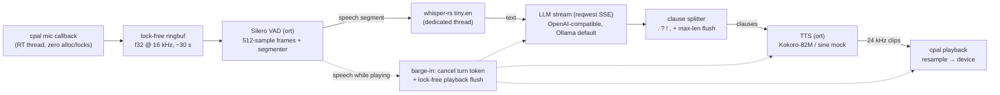

# skadoosh

[](https://crates.io/crates/skadoosh)
[](https://docs.rs/skadoosh)
[](https://github.com/Hot-Coco/Skadoosh/actions/workflows/ci.yml)
[](LICENSE-MIT)

**A modular, lightning-fast, fully local voice agent framework in Rust** — targeting
sub-150 ms from end-of-speech endpointing to first audio out on capable hardware.

Mic in. Silero VAD listens. Whisper transcribes. A local LLM streams a reply.
Kokoro speaks each clause as soon as it lands. Interrupt it mid-sentence and it
shuts up instantly. No cloud required.



## Why skadoosh

- **Streaming at every stage after STT** — the LLM token stream is split into
  clauses (`.`, `?`, `!`, `,`), each clause is synthesized the moment it
  arrives, and playback starts on the first clause. You never wait for the
  full reply.
- **Barge-in that actually works** — speak while the agent is talking and the
  turn is cancelled (LLM stream aborted via `CancellationToken`) and the
  playback ring buffer is flushed within one output callback period
  (~5–10 ms), lock-free.
- **Real-time safe audio edge** — the cpal callbacks never allocate or lock;
  they push/pull through `ringbuf` SPSC queues. Everything else is ordinary
  `tokio` tasks on bounded `mpsc` channels.
- **Headless-testable** — a sine-wave `MockTts`, a wav-driven `--selftest`
  mode, and a mock OpenAI SSE server mean the whole pipeline is CI-green with
  no microphone, speaker, GPU, or Ollama install.
- **`#![forbid(unsafe_code)]`** — dependencies may use unsafe; we don't.

## Latency budget

The sub-150 ms target applies to **endpoint → first audio** (STT + LLM
time-to-first-token + first-clause TTS + playback start). The 300 ms endpoint
window (configurable via `--silence-ms`) sits on top and is the dominant fixed
cost of knowing you finished talking.

| Stage | Typical budget | Notes |
|---|---|---|
| VAD frame window | 32 ms | fixed by Silero frame size (512 @ 16 kHz) |
| Endpoint silence | 300 ms | `--silence-ms`; tunable |
| STT tiny.en (short segment) | ~50–150 ms | CPU, 4 threads |
| LLM TTFT (qwen2.5:0.5b, warm Ollama) | ~30–80 ms | first SSE chunk |
| TTS first clause (Kokoro) | ~40–100 ms | short clause |
| Playback start | ~10–20 ms | small ring buffer |

These are measured, not assumed: every turn logs a per-stage breakdown
(`t_speech_end → t_text → t_first_clause → t_first_clip → t_first_audible`),
and `--selftest` prints the full table. Total speech-end → first-audio is
hardware-dependent.

## Requirements

- **Rust ≥ 1.88** (the `ort` 2.0 rc line requires it)
- **Build deps:** `cmake`, a C/C++ toolchain, `clang`/`libclang`
  (whisper.cpp bindings), `pkg-config`, ALSA headers on Linux
  (`sudo apt install build-essential cmake clang libclang-dev pkg-config libasound2-dev`)
- **[Ollama](https://ollama.com)** (or any OpenAI-compatible server) for the
  default LLM backend
- **Optional:** `espeak-ng` — required at runtime only for the real Kokoro TTS
  engine (the `MockTts` fallback needs nothing)
- First build downloads a prebuilt ONNX Runtime (one-time, cached); see
  `ort`'s `load-dynamic` feature if you need to link a system ORT instead.

## Quickstart

```bash
# 1. LLM backend
ollama pull qwen2.5:0.5b
ollama serve   # listens on http://localhost:11434

# 2. Models + test fixture (Silero VAD ~2 MB, whisper tiny.en ~74 MB)
./scripts/download_models.sh
# real neural TTS (optional, ~320 MB, needs espeak-ng):
./scripts/download_models.sh --with-kokoro
sudo apt install espeak-ng

# 3. Run the agent
cargo run --release
```

Talk. It answers. Talk over it. It stops.

Useful variations:

```bash
skadoosh --list-devices                          # enumerate audio I/O
skadoosh --input-device "USB Mic" --output-device "Headphones"
skadoosh --silence-ms 250 --vad-threshold 0.6    # snappier / stricter endpointing
skadoosh --mock-tts                              # pipeline demo with zero TTS model
skadoosh --llm-url http://gpu-box:11434/v1 --llm-model qwen2.5:1.5b
```

Every flag falls back to a `SKADOOSH_*` environment variable
(`SKADOOSH_LLM_MODEL=qwen2.5:1.5b skadoosh`).

## No audio hardware? Run the selftest

`--selftest` drives the real VAD → STT → LLM → TTS chain from a wav file and
writes the synthesized reply to `selftest_out.wav` — no mic or speaker needed:

```bash
cargo run --release -- --selftest tests/data/jfk.wav --mock-tts
```

```text
skadoosh selftest — latency report
  vad segmentation                     65 ms
  stt (whisper)                       677 ms
  llm time-to-first-token               0 ms   (loopback mock)
  llm first clause                      0 ms
  tts first clip                        0 ms   (MockTts)
  total                               761 ms
```

(measured on an 8-core cloud box with a mock LLM and MockTts; your numbers
with a warm Ollama + Kokoro will differ — that's the point of the table.)

## Configuration

| Flag | Env | Default | Meaning |
|---|---|---|---|
| `--llm-url` | `SKADOOSH_LLM_URL` | `http://localhost:11434/v1` | OpenAI-compatible base URL |
| `--llm-model` | `SKADOOSH_LLM_MODEL` | `qwen2.5:0.5b` | chat-completions model name |
| `--system-prompt` | `SKADOOSH_SYSTEM_PROMPT` | spoken-style brevity prompt | seeded as message 0 |
| `--max-history-turns` | `SKADOOSH_MAX_HISTORY_TURNS` | `8` | trailing user/assistant turns kept |
| `--whisper-model` | `SKADOOSH_WHISPER_MODEL` | `models/ggml-tiny.en.bin` | whisper.cpp ggml model |
| `--vad-model` | `SKADOOSH_VAD_MODEL` | `models/silero_vad.onnx` | Silero VAD ONNX |
| `--tts-model` | `SKADOOSH_TTS_MODEL` | — | Kokoro ONNX (absent → MockTts) |
| `--tts-voices` | `SKADOOSH_TTS_VOICES` | — | Kokoro voice bank (`voices.bin`) |
| `--vad-threshold` | `SKADOOSH_VAD_THRESHOLD` | `0.5` | speech probability threshold |
| `--silence-ms` | `SKADOOSH_SILENCE_MS` | `300` | trailing silence that ends a segment |
| `--input-device` / `--output-device` | `SKADOOSH_INPUT_DEVICE` / `SKADOOSH_OUTPUT_DEVICE` | default | device names |
| `--list-devices` | — | — | enumerate devices and exit |
| `--mock-tts` | `SKADOOSH_MOCK_TTS` | off | force the sine-wave TTS |
| `--selftest <wav>` | `SKADOOSH_SELFTEST` | — | headless end-to-end run |

## How barge-in works

The VAD never stops listening, even during playback. A speech onset while the
speaker is active (with a 64 ms hangover to reject clicks) makes the
orchestrator:

1. cancel the per-turn `CancellationToken` — the LLM SSE stream and any
   queued clauses die immediately (partial replies are discarded from
   history, since you never heard them);
2. bump a lock-free *flush epoch* — the playback callback notices on its next
   period and clears the ring itself, so audio stops within ~5–10 ms with no
   locks on the real-time thread.

Your new utterance is already accumulating in the segmenter and flows to
Whisper while the old turn unwinds. Stale-turn clips are dropped defensively
via turn IDs.

> **Note:** barge-in assumes headphones. With speakers, the agent's own output
> will trigger the VAD (no echo cancellation in v1).

## Architecture map

| File | Role |
|---|---|
| `src/audio/input.rs` | cpal capture → mono-mix → resample → lock-free ring |
| `src/audio/output.rs` | playback thread, flush-epoch, `is_playing` |
| `src/audio/resample.rs` | zero-dep linear resampler, allocation-free steady state |
| `src/vad/silero.rs` | stateful Silero v5 wrapper (`ort`) |
| `src/vad/mod.rs` | pure segmenter state machine (preroll, endpointing) |
| `src/stt/whisper.rs` | whisper-rs on a dedicated thread, bounded job queue |
| `src/llm/client.rs` | streaming SSE chat-completions client + history |
| `src/llm/splitter.rs` | UTF-8-safe clause boundary detector |
| `src/tts/onnx.rs` | Kokoro-82M via `ort` (style bank indexed by token count) |
| `src/tts/mock.rs` | sine-wave engine for tests and demos |
| `src/tts/phonemes.rs` | espeak-ng phonemizer + IPA normalization + tokenizer |
| `src/pipeline.rs` | orchestrator: 8 tasks, 9 channels, barge-in, shutdown |

## Testing

The default suite is fully headless and runs everywhere:

```bash
cargo test          # 60+ tests: real VAD + Whisper on jfk.wav, mock LLM SSE, e2e selftest
cargo clippy --all-targets -- -D warnings
cargo fmt --check
```

Opt-in gates:

- `SKADOOSH_KOKORO_TESTS=1` — real Kokoro synthesis (needs
  `download_models.sh --with-kokoro` + `espeak-ng`)
- `SKADOOSH_AUDIO_TESTS=1` — real cpal device capture/playback

Skipped tests always print why and name the variable that enables them.

## Roadmap

- [ ] Wake word / push-to-talk modes
- [ ] GPU execution providers (CUDA/CoreML) for `ort` sessions
- [ ] Echo cancellation for speakerphone barge-in
- [ ] misaki-quality G2P (v1 phonemizes with espeak-ng + normalization —
      expect occasional mispronunciations)
- [ ] More Kokoro voices exposed via CLI; voice/speed flags
- [ ] Tool calling / multi-turn agents

## License

Dual-licensed under [MIT](LICENSE-MIT) or [Apache-2.0](LICENSE-APACHE), at
your option.
